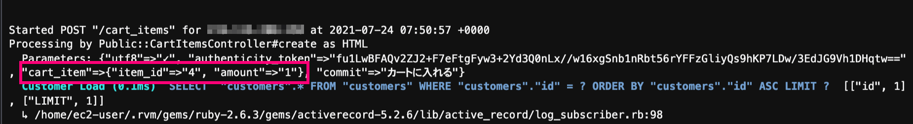

# ハッシュとは、キーと値をセットで保存できるデータの集合

~~~
画像の場合、{"item_id"=>"4", "amount"=>"1"}という部分がハッシュとなり
item_id というキーは 4 という値・amount というキーは 1 という値を保持しています。

また、画像のピンク枠の部分「"cart_item"=>{"item_id"=>"4", "amount"=>"1"}」は
2次元ハッシュと呼ばれるもので、ハッシュの中にハッシュが入るという入れ子構造になっています。

つまり、cart_item というキーに対して{"item_id"=>"4"と"amount"=>"1"}という値が存在していて
その中に{"item_id"=>"4", "amount"=>"1"}というハッシュが存在しているということになります。
まとめると以下の図のようになります。
~~~
~~~
ハッシュ/キー/値

"cart_item"=>{"item_id"=>"4", "amount"=>"1"}/	
cart_item/
{item_id"=>"4", "amount"=>"1"}

{"item_id"=>"4", "amount"=>"1"}	/
"item_id"/
	"4"

"amount"	/
"1"
~~~

~~~
この中の item_id と amount の値を取り出しデータベースへ格納するために、ストロングパラメータを定義します。

app/controllers/cart_items_controller.rb
  :
  :
  private
  def cart_item_params
      params.require(:cart_item).permit(:item_id, :amount)
  end
こうすることで以下のようにパラメータを取得することができます。
~~~

