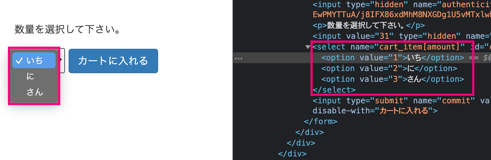

# セレクトボックス
~~~
Viewファイル
【構文】
<%= f.select :プロパティ名, (配列 or ハッシュ) %>
【使用例】
<%= f.select :amount, [['いち',1], ['に',2], ['さん',3]] %>
~~~

~~~
この場合だと、下記画像のように
「いち」が選択された場合「1」という値・「に」が選択された場合「2」という値・「さん」が選択された場合「3」という値を送ることができます。
~~~

~~~
また、表示するデータと送るデータが同じになる場合、ループを用いることで下記のように利用することも可能です。

<%= f.select :amount, *[1..3] %>

~~~

